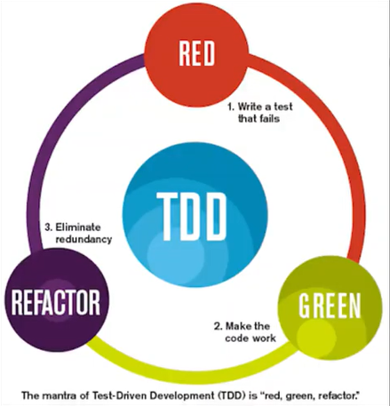

# Test-Driven Development

### TDD

* 미국의 소프트웨어 엔지니어인 켄트 벡이 출신
* 익스트림 프로그래밍 창시자

### 익스트림 프로그래밍?

* **요구사항이 급변하는 분야에 적합한 개발 방법론**
* 기존의 waterfall 방식의 방법론이 대세를 이뤘지만,
  * 시장 상황이 복잡해지고, 비즈니스가 다양해진 방식에 **waterfall 방식으로 다루기 어려운 것들이 생겼다**
  * 이런 상황에선 어떤 방식을 사용하는 것이 효율적일까? 의 생각에서 나온 방식

#### 익스트림 프로그래밍을 실천하기 위한 여러 가지 방법

* 여러가지가 있음
  * Customer Tests
  * Code Review
  * Simple Design
  * Small Releases
  * **Test-Driven Development**
  * Pair Programming
  * .....
* 여러가지 다 좋았지만, TDD가 가지고 있는 장점 및 함의가 좋아서 여러 분야에서 이것만 떼서 사용하고 있을 정도로 대중적이고 중요한 방법론이 **TDD.**

## WHAT(TDD가 무엇인가)

* **테스트 코드를 먼저 짜고 그 이후에 코드를 짜는 방법**

* 지금까지의 방식

  1. 디자인
  2. 코드 개발
  3. 테스트
  4. 이후 설계(디자인)수정
     * 재사용이 어렵고, 관리가 어려워져 유지보수를 어렵게 만듬.
     * 작은 기능의 부분 수정에도 모든 부분을 테스트해야 하므로 전체적인 버그를 검출하기 어려워짐.

  

* TDD의 방식

  1. 요구사항 파악
  2. 테스트 코드 작성
  3. 테스트 코드가 돌아가도록 실제 코드 작성
  4. 리팩토링
  5. 다시 1번부터

이런 방식은 **Cycle**로 표현된다.

* **RED** :arrow_forward: test를 작성함. 대신, 그 test는 아직 구현이 없기 때문에 실패할 것.
* **GREEN** :arrow_forward: 이를 위해 test를 통과하는 최소한의 구현(실제 코드)을 만듬.
* **REFACTOR** :arrow_forward: test를 통과하는 보장된 코드가 있기 때문에, 심리적으로 안정된 상태에서 리팩토링을 함.

#### 간단한 Diagram이지만, 테스트 코드를 작성하는 능력이 없다면 어렵고 복잡하다.

## WHY(왜 TDD를 해야 할까)

* 굳이 왜 많은 테스트 케이스를 작성하고 그거에 따른 테스트 코드부터 작성해야 할까?
* 그냥 기존의 방식처럼 만들고, 테스트를 해보면 되는거 아닐까? 시간이 더 드는거 아닌가?
  * **기존의 방식** :arrow_forward: 처음부터 모든것을 다 예측해야 하는 문제점이 생김. 
    * 이 프로그램을 어떻게 발전 시켜야 할지, 어떤 요구사항이 생길지를 다 예측해서 이를 다 수용할 수 있는 프로그램을 제작해야 함.
  * **현재의 방식** :arrow_forward: 시장상황도 너무 복잡해지고, 이에 따라 바뀌어야 할 것도 많음.
    * **Over Engineering** :arrow_forward: 시스템이 무거워지고, 유지보수가 어려워짐.
    * 이를 해결하고자 Simple하고, 최소한의 것들로 만들어야 하는 것이 중요해짐.
  * **해외의 방식** :arrow_forward: **TDD를 하지 못하면 해외 취업이 어려움!**
  * **개발자의 방식** :arrow_forward: 오픈소스에 Contribute를 하기 위해서는 안에 돌아가는 Test Code가 있고, 이를 이해한 뒤 코드를 짤 수 있기 때문에 Test Code에 대해 아는 것도 중요해짐.
* **TDD의 장점**
  1. 동작하는 코드에 대한 자신감 (Clean Code that works)
     * 옛날에는 이 코드가 돌아갈지 안 돌아갈 지 몰랐다. 일단 작성하고 난 뒤 테스트를 했음.
     * 일단 작동이 되는걸 보고, 어떤 테스트 케이스를 넣더라도 실행이 된다는 보장.
       * 그만큼 test case를 많이 만들어야 함.
       * 어떤 test case가 있을 지 미리 생각해야 함.
  2. 과도한 설계를 피하고, 간결성 증대
  3. 실행 가능한 문서를 가짐
     * software에서 문서화는 정말 중요(다른 사람과 협업을 하기 위한 중요 요소)
     * 이를 계속 작성하기란 어려운데, test code 자체가 문서로써 작용할 수 있음.
  4. 디자인적 유연함, 의존성 관리 편함
     * test code는 독립되어 있고, 분리되어 있는 것.
       * 이를 위해서 자연스럽게 독립적이게 됨.
* **TDD의 단점**
  1. 생산성의 저하
     * 개발 속도가 느려지기 때문.
     * 처음부터 2개의 코드를 짜야 하고, 중간 중간 테스트를 하면서 고쳐나가야 함.

## Note

### TDD가 어려운 이유

1. 이제까지 개발하던 방식을 많이 바꿔야 함.
2. TDD는 이렇게 해야 한다는 선입견이 있음.
   * 반드시 툴을 써서 개발해야 한다는 선입견(이런 규칙에 얽매이는 것은 애자일 방식이 X)

### TDD를 잘 하는 방법

1. Unit Test부터 연습하고 TDD를 숙련해야 함.
2. 어떻게 하면 테스트 비용을 낮출 수 있을까를 고민해야 함.

java 단위 테스트 프레임워크 :arrow_forward: JUnit

#### 출처

---

https://wooaoe.tistory.com/33

https://youtu.be/meTnd09Pf_M

https://youtu.be/xs-yhBlkbbQ