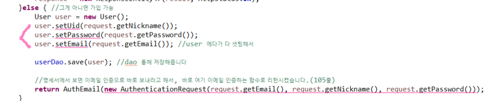
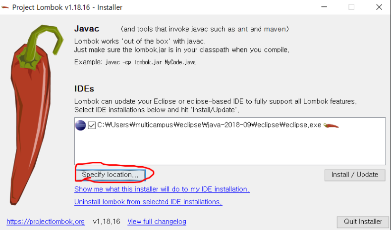
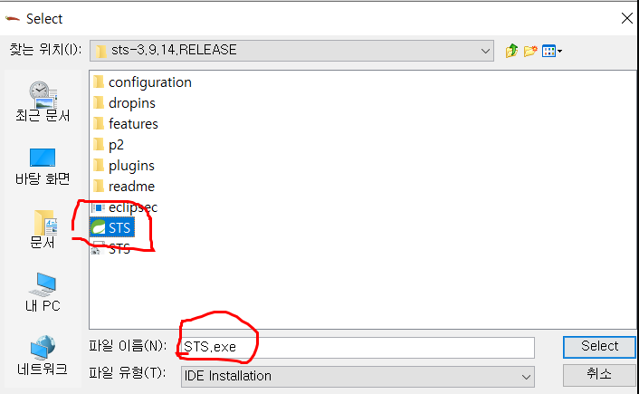
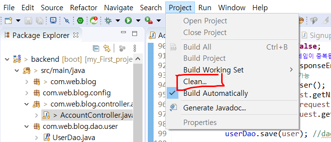

# lombok 과 STS연동하기

* 처음으로 lombok을 써 봐서 많은 오류가 있었다.

### 문제 상황

* lombok을 이용해서 **@Getter, @Setter**를 지정했지만 빨간줄이 떴다.

---

### 해결 방안

1. lombok.jar를 다운 받아서 실행 시켜줬다.

   

2.  위 화면에서 Specify location..을 클릭해서 STS.exe경로를 찾아 선택해 준다. (경로는 설치한 사람에 따라 다 다름)

   

3. **Install / Update** 를 클릭하고, 설치가 완료되면 Quit Installer를 눌러준다.

4. STS를 껐다 켜고 난 뒤, Clean을 한 번 해 주면 빨간 줄이 뚝딱 없어진다!

   